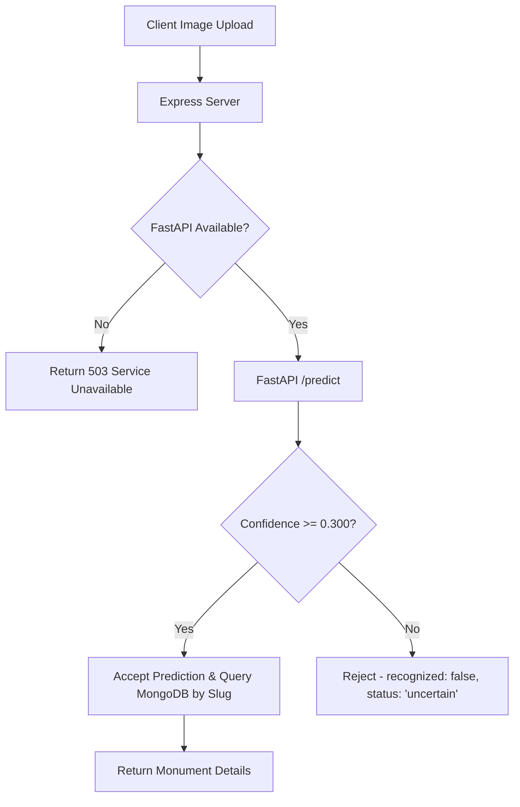

# HERIXA AI — Monument Recognition System

This directory contains the machine learning model, API service, and validation scripts for identifying cultural heritage monuments, specifically focusing on the **Brihadeeswarar Temple** in Thanjavur.

## 1. Directory Structure

```
ai/
├── api/                  # FastAPI service implementation
│   ├── inference.py      # Preprocessing, ONNX inference, postprocessing utilities
│   ├── main.py           # FastAPI server with /health and /predict endpoints
│   ├── requirements.txt  # FastAPI dependencies
│   └── schemas.py        # Request/Response schemas (Pydantic models)
├── dataset/              # Dataset splits (built from raw images)
│   ├── train/            # Training split (Brihadeeswarar vs. Hard Negatives)
│   ├── validation/       # Validation split
│   └── test/             # Test split
├── models/               # Serialized trained model weights and exports
│   ├── best_model.pth    # PyTorch model weights checkpoint and calibration parameters
│   ├── best_model.onnx   # ONNX model structure
│   └── best_model.onnx.data # ONNX model weight tensors (external file)
├── results/              # Evaluation reports, duplicate logs, training charts
└── src/                  # Pipeline utility scripts
    ├── build_dataset.py  # Crawling and loading local raw images
    ├── train.py          # PyTorch EfficientNet-B0 model training
    ├── evaluate.py       # Calibration and validation evaluation
    └── validate_onnx.py  # PyTorch vs. ONNX numerical parity validation
```

---

## 2. Model Architecture

- **Base Network**: **EfficientNet-B0** pre-trained on ImageNet. Used for its high parameter efficiency and lightweight performance on edge and CPU platforms.
- **Custom Classification Head**:
  - Dropout layer ($p = 0.2$) for regularization.
  - Linear projection layer: $1280 \to 2$ outputs representing classes `[brihadeeswarar, hard_negatives]`.
- **Inference Runtime**: Exported to **ONNX Runtime (CPU)** to reduce memory usage and accelerate latency in production servers.

---

## 3. Dataset Information

The dataset is partitioned into classes of interest (target monument) and hard negative distractions:
- **Classes**:
  - `brihadeeswarar`: Target monument (pyramidal Vimana tower, gopuram entrances, plinths, stone carvings).
  - `hard_negatives`: Other historic temples and structures (e.g., Meenakshi Amman Temple, Gangaikonda Cholapuram, Ranganathaswamy Temple) sharing similar Dravidian architectural details.
- **Splits**:
  - **Training**: Used to optimize the parameters of the classification head.
  - **Validation**: Used to optimize hyperparameters and identify the temperature scaling and decision thresholds.
  - **Test**: Kept separate to verify final generalization metrics.

---

## 4. Training Information

- **Framework**: PyTorch & Torchvision.
- **Optimizer**: Adam ($lr = 1\times 10^{-3}$, weight decay $= 1\times 10^{-4}$).
- **Loss Function**: Cross Entropy Loss.
- **Epochs**: 15 (with Early Stopping on validation loss).
- **Batch Size**: 16.
- **Augmentation**: Random horizontal flipping, random rotation ($\pm 10^\circ$), color jittering, and random affine transformations to increase resilience to user photography variations.

---

## 5. Phase 5 Calibration & Evaluation Metrics

To maximize reliability in actual user tests (minimizing false acceptances on other temples), the raw logits were calibrated using **Temperature Scaling** ($T$) on the validation set, and a high-recall **optimal threshold** was chosen.

- **Calibrated Parameters**:
  - **Temperature ($T$)**: `1.250` (softens overconfident logits).
  - **Optimal Decision Threshold**: `0.300` (any probability of Brihadeeswarar $\ge 30\%$ triggers identification to avoid false rejections).
  - **Best Fusion Method**: `mean_prob` (average probability across multiple views).
- **Test Performance**:
  - **Accuracy**: $73.33\%$
  - **Precision**: $74.07\%$
  - **Recall**: $80.00\%$
  - **F1 Score**: $76.92\%$
  - **Confusion Matrix**: TP: 20, TN: 13, FP: 7, FN: 5.

---

## 6. FastAPI Service Usage

The FastAPI server wraps the ONNX model to provide a lightweight local microservice.

### Setup and Execution

1. Navigate to the `ai` directory and activate the virtual environment:
   ```powershell
   cd ai
   .venv\Scripts\activate
   ```
2. Start the FastAPI server using Uvicorn on port `8001`:
   ```powershell
   python -m uvicorn src.service:app --host 127.0.0.1 --port 8001
   ```

### API Endpoints

#### 1. GET `/health`
Returns the status of the service and loaded model.
- **Response**:
  ```json
  {
    "status": "ok",
    "model": "best_model.onnx",
    "model_loaded": true
  }
  ```

#### 2. POST `/predict`
Accepts an image file upload and returns the model prediction and confidence score.
- **Request Form-Data**:
  - `image`: File (JPEG/PNG)
- **Response**:
  ```json
  {
    "success": true,
    "prediction": "brihadeeswarar",
    "confidence": 0.7850,
    "accepted": true,
    "threshold": 0.3,
    "temperature": 1.25,
    "model": "onnx",
    "processing_time_ms": 110,
    "p_brihadeeswarar": 0.7850
  }
  ```

---

## 7. Express Integration & Trained AI Model Architecture

The Express backend serves as the main gateway for client requests. It communicates directly with the local FastAPI inference service, querying predictions, and resolving the recognized monuments dynamically.

### Recognition Workflow



### Architecture Implementation Highlights

1. **Authoritative Model**: Recognition relies exclusively on the trained machine learning model, ensuring local processing without external AI fallbacks.
2. **Quality Gate**: Filters out blurry, corrupted, or small base64 uploads before forwarding them to the FastAPI microservice.
3. **Dynamic Resolution**: Supports dynamic lookup of monument documents in MongoDB using the predicted class name as the slug, allowing easy scaling for new monument classes.

